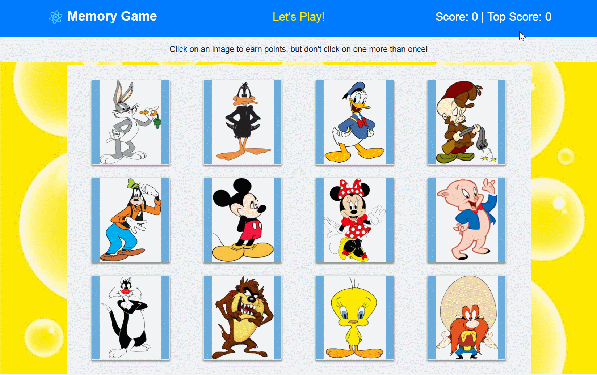

# Memory-Game

Front-end Memory Game application built using React. The application incorporates both stateful and stateless components while adding some dynamic styling.

## How to Play

The user starts the game by clicking on a character. The user then continues to click on characters until either 1) A character is clicked which has already been guessed or 2) No further non-guessed characters exist. At this point, the round ends and a new round begins.

The score is tallied for each round, along with a tally for the Top Score of the game. 

A new game can be initiated by clicking the "Memory Game" banner or refreshing the page.

Please refer to the video below for details regarding how the app works.

## Getting Started

You should be able to download the files via the github pages link below and run locally on your computer:
[https://github.com/emswann/memory-game](https://github.com/emswann/memory-game).

The application has also been published on Heroku:
[https://memory-game-ems.herokuapp.com/](https://memory-game-ems.herokuapp.com/).

## Prerequisites (for local computer)

Yarn install based on package.json.
Yarn start to run application.

## Built With

* [react](https://reactjs.org/) - JavaScript library for building user interfaces. 
* [react-dom](https://www.npmjs.com/package/react-dom) - JavaScript package library paired with React and used for rendering html objects.
* [react-scripts](https://www.npmjs.com/package/react-scripts) - JavaScript package library includes s scripts and configuration used by Create React App.

## Contributing

Please feel free to offer any suggestions. As always, programming is a work of art in progress.

## Author

* **Elaina Swann** - [Github](https://github.com/emswann)
